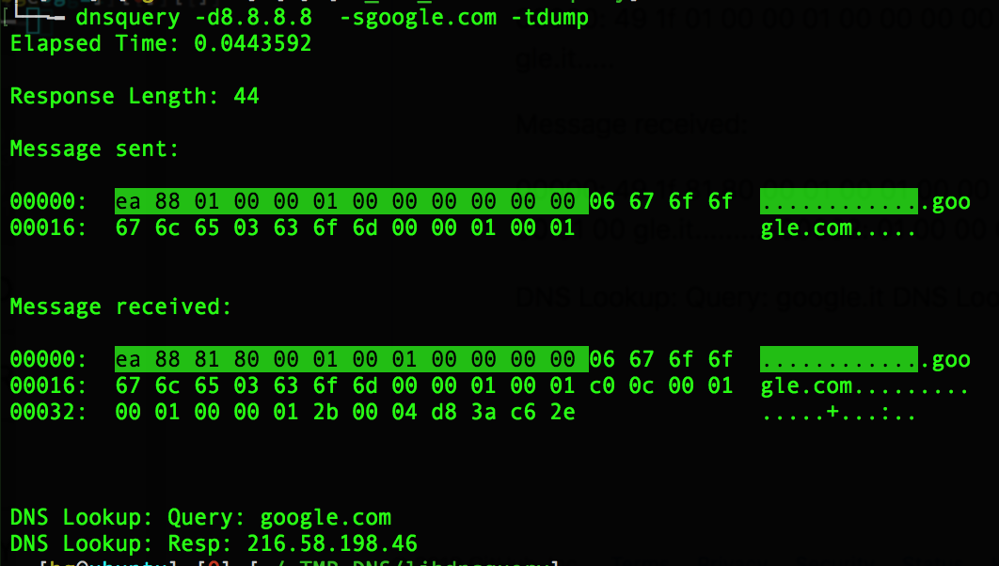

Description:
============

A library to interrogare DNSs written in c++11/14, starting from RFCs and a demo tool.

Trivia:
=======

This is a lite version of a bigger library, I removed some feature (as testified by the preprocessor's calls) involving reflection attacks and some other I think are too experimental.

DISCLAIMER:
===========

This code has been posted for information and educational purposes. The intrusion in systems and services without the owner's authorisation is illegal. The misuse of the information and the software in this repo can result in criminal charges brought against the perpetrator of the crime. Any actions and or activities related to the material contained within this Git Repository is solely your responsibility. The author will not be held responsible in the event any criminal charges be brought against any individuals misusing the information or the software in this website to break the law.

Prerequisites:
==============

The program is tested on both Linux and OS X, but should be easy to port elsewhere.

It's tested using this/these distributions of Linux:

- Ubuntu 18.04.1 LTS

using, as compiler, one in this list:

- gcc version 7.3.0 (Ubuntu 7.3.0-27ubuntu1~18.04) 

It's tested using this/these distributions of Os X:

- Os X 10.13.6

using, as compiler, one in this list:

- cland (Apple LLVM version 10.0.0 (clang-1000.11.45.5))

Installation:
=============

- launch the configure script:
  ./configure
- Compile the program:
  make
- Install the program and the man page:
  sudo make install

Command Line Examples:
=====================

- Simple query:
   ./src/dnsquery -d8.8.8.8 -sgoogle.it
   216.58.205.195

- Simple query with length:
  ./src/dnsquery -d8.8.8.8 -sgoogle.it -l
  Response Length: 43
  216.58.205.195

- Decode the previous file:
  ./src/dtmf -t./xxx  -o./dtmf.bintest.again

- "Ping" mode:
  ./src/dnsquery -d8.8.8.8 -sgoogle.it -tping
  43 bytes from 8.8.8.8 dns_seq=0 time=0.044613 ms
  43 bytes from 8.8.8.8 dns_seq=1 time=0.016406 ms
  43 bytes from 8.8.8.8 dns_seq=2 time=0.016617 ms
  43 bytes from 8.8.8.8 dns_seq=3 time=0.021073 ms

- Dump mode:

