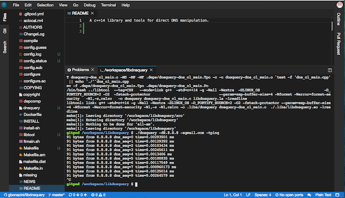

Description:
============

A library to interrogare DNSs written in c++11/14, starting from RFCs and a demo tool.

Trivia:
=======

This is a lite version of a bigger library, I removed some feature (as testified by the preprocessor's calls) involving reflection attacks and some other I think are too experimental.

DISCLAIMER:
===========

This code has been posted for information and educational purposes. The intrusion in systems and services without the owner's authorisation is illegal. The misuse of the information and the software in this repo can result in criminal charges brought against the perpetrator of the crime. Any actions and or activities related to the material contained within this Git Repository is solely your responsibility. The author will not be held responsible in the event any criminal charges be brought against any individuals misusing the information or the software in this website to break the law.

Prerequisites:
==============

The program is tested on both Linux and OS X, but should be easy to port elsewhere.

It's tested using this/these distributions of Linux:

- Ubuntu 18.04.1 LTS

using, as compiler, one in this list:

- gcc version 7.3.0 (Ubuntu 7.3.0-27ubuntu1~18.04

*On Linux libcap-dev is required.*


It's tested using this/these distributions of Os X:

- Os X 10.13.6

using, as compiler, one in this list:

- cland (Apple LLVM version 10.0.0 (clang-1000.11.45.5))

Installation:
=============

- launch the configure script:
  ./configure
- Compile the program:
  make
- Install the program and the man page:
  sudo make install

Try it live:
============

Using this link (a Github account is required), it's possible to test this program on Gitpod:

[](https://gitpod.io/#https://github.com/gbonacini/libdnsquery)

A Docker environment will be created, the depencies installed and the program compiled.
After that you can test it running a  proper command in the terminal, as this example show:




Command Line Examples:
=====================

- Simple query:<BR>
   ./src/dnsquery -d8.8.8.8 -sgoogle.it<BR>
   216.58.205.195<BR>

- Simple query with length:<BR>
  ./src/dnsquery -d8.8.8.8 -sgoogle.it -l<BR>
  Response Length: 43<BR>
  216.58.205.195<BR>

- Request a specific type of RR from the result:<BR>
  ./src/dnsquery -d1.1.1.1 -sgmail.com -aaaaa<BR>
  empty response<BR>
<BR>
  If no answer of the requeste type is available, the string "empty response" will be the result.

- Dump mode:<BR>

  

- "Ping" mode:<BR>
  ```shell
  ./src/dnsquery -d8.8.8.8 -sgoogle.it -tping
  43 bytes from 8.8.8.8 dns_seq=0 time=0.044613 ms
  43 bytes from 8.8.8.8 dns_seq=1 time=0.016406 ms
  43 bytes from 8.8.8.8 dns_seq=2 time=0.016617 ms
  43 bytes from 8.8.8.8 dns_seq=3 time=0.021073 ms
  ```

- "Traceroute mode" (this option only needs privile: use sudo, In some virtualized environment ICMP error messages 
  are filtered when the connection came from a NAT, a workaround cold be to switch in "bridged" mode.):<BR>

  ```shell
  sudo ./src/dnsquery -d1.1.1.1 -swww.ipv6.net.cn -X

  ttl: 2 ... omissis ... 
  ttl: 3 ... omissis ... 
  ttl: 4 ... omissis ... 
  ttl: 5 ... omissis ... 
  ttl: 6 ... omissis ... 
  ttl: 7 ... omissis ... 
  ttl: 8 ... omissis ... 
  ttl: 9 ... omissis ... 
  ttl: 10 from: 	93.57.68.221	93.57.68.221	93.57.68.221
  ttl: 11 from: 	193.201.28.33	193.201.28.33	193.201.28.33
  ttl: 12 from: 	1.1.1.1	(DNS answer)

  Dump:

  00000:  d4 07 81 80 00 01 00 01 00 00 00 00 03 77 77 77  .............www
  00016:  04 69 70 76 36 03 6e 65 74 02 63 6e 00 00 01 00  .ipv6.net.cn....
  00032:  01 c0 0c 00 01 00 01 00 00 02 58 00 04 1b dd 14  ..........X.....
  00048:  e4                       
  ```
